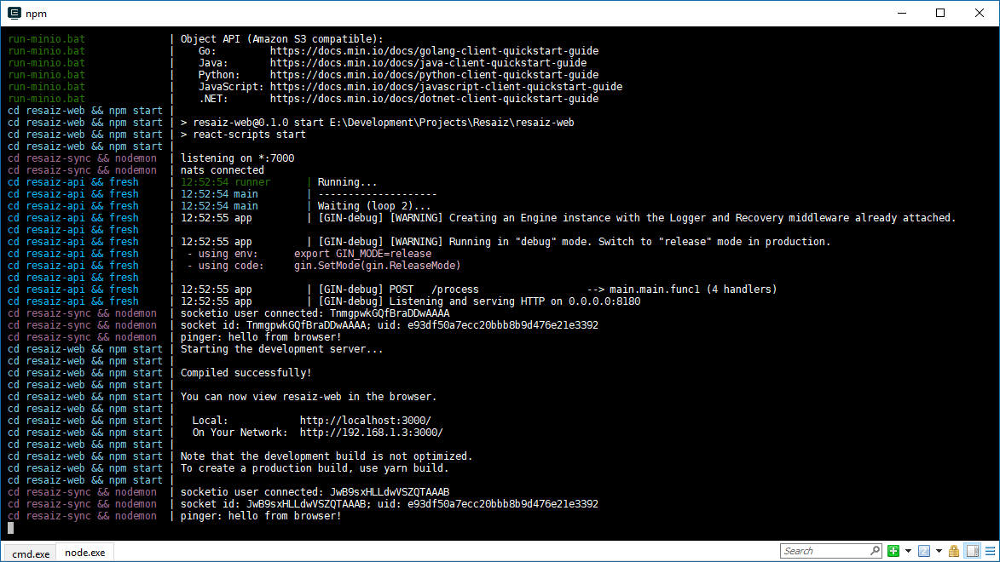

# prun

prun is a CLI tool to run commands in parallel with aggregated and coloured output like docker-compose.

It a very early version but kind of funcional right now (only Windows, Linux support comming soon).

## Installation

    go get github.com/mkarpusiewicz/prun

## Usage

    prun server.exe "database/run-db.bat" "cd web && npm start"

### Note

When a path is detected e.g. `database/run-db.bat` the working directory for the command is changed automatically. For Windows the real executed command is `cd database && run-db.bat`.

This means you can use shortened version `web/npm start` instead of `cd web && npm start` even if `npm` or any other executable is not in that directory.

Also commands are run by the interpreter/shell, for windows it's `cmd` so e.g. for `server.exe` the process run is `cmd /c server.exe`

## Todo

- Linux support
- Custom colouring for commands
- Custom naming for commands
- Support for configuration file so you can just `cd` to directory and `prun`
